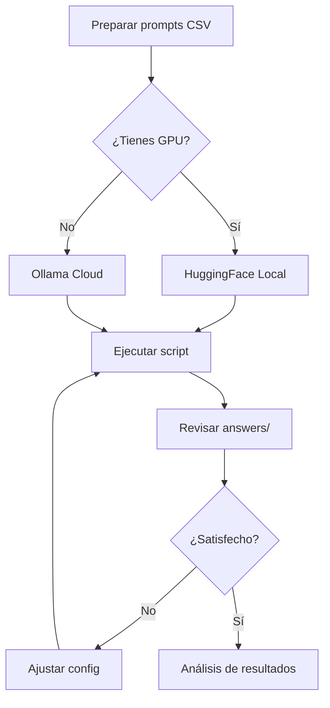

# 🤖 PyCharm Misc Project - AI Prompt Processing System

Sistema completo para procesar prompts con modelos de IA, disponible en dos implementaciones:

- **🖥️ HuggingFace Local**: Ejecuta modelos localmente en tu GPU
- **☁️ Ollama Cloud**: Ejecuta modelos en la nube mediante API

## 🚀 Inicio Rápido

### ¿Primera vez aquí?

1. **Lee la guía de instalación**: [`INSTALLATION.md`](INSTALLATION.md)
2. **Elige tu implementación**:
   - **Principiantes** → Ollama Cloud (5 minutos de setup)
   - **Avanzados con GPU** → HuggingFace Local (1-2 horas de setup)

### Setup Rápido - Ollama Cloud

```bash
cd Ollama
setup.bat
set OLLAMA_API_KEY=tu_api_key_aqui
python test_connection.py
execute.bat
```

### Setup Rápido - HuggingFace Local

```bash
cd huggingFace
python -m venv .venv
.venv\Scripts\activate
pip install torch torchvision torchaudio --index-url https://download.pytorch.org/whl/cu121
pip install transformers pandas huggingface_hub accelerate
python check_gpu.py
execute.bat
```

## 📁 Estructura del Proyecto

```
PyCharmMiscProject/
│
├── 📖 README.md                    ← Estás aquí
├── 📖 INSTALLATION.md              ← Guía de instalación completa
├── 📖 COMPARISON.md                ← Comparación HF vs Ollama
├── 📖 PROJECT_STRUCTURE.md         ← Estructura detallada
│
├── 🖥️ huggingFace/                ← Implementación Local (GPU)
│   ├── script.py
│   ├── script_models_config.py
│   ├── execute.bat
│   ├── prompts/
│   ├── answers/
│   └── logs/
│
└── ☁️ Ollama/                     ← Implementación Cloud (API)
    ├── script.py
    ├── script_models_config.py
    ├── test_connection.py
    ├── execute.bat
    ├── setup.bat
    ├── README.md
    ├── QUICKSTART.md
    ├── prompts/
    ├── answers/
    └── logs/
```

## 🎯 Características Principales

### ✨ Ambas Implementaciones Incluyen

- ✅ **Paralelización**: Procesa múltiples prompts simultáneamente
- ✅ **Reinicio Automático**: Continúa desde donde se quedó si se interrumpe
- ✅ **Logging Completo**: Registros detallados de toda la ejecución
- ✅ **Manejo de Errores**: Reintentos automáticos y recuperación
- ✅ **Guardado Incremental**: Guarda cada respuesta inmediatamente
- ✅ **Multi-modelo**: Procesa con varios modelos secuencialmente
- ✅ **Skip Completados**: Solo procesa respuestas pendientes

### 🖥️ HuggingFace Local - Características Específicas

- 🔒 **Privacidad Total**: Los datos nunca salen de tu máquina
- ⚡ **Baja Latencia**: Procesamiento local sin red
- 💪 **GPU Optimizado**: Usa CUDA con FP16 para máxima eficiencia
- 🎛️ **Control Total**: Acceso completo a parámetros del modelo
- 💰 **Sin Costos de API**: Solo inversión inicial en hardware

### ☁️ Ollama Cloud - Características Específicas

- 🚀 **Setup Instantáneo**: Listo en 5 minutos
- 💻 **No Requiere GPU**: Funciona en cualquier PC
- 📈 **Escalable**: Sin limitaciones de hardware
- 🔄 **Siempre Actualizado**: Modelos actualizados automáticamente
- 💵 **Pago por Uso**: Sin inversión inicial

## 📊 Comparación Rápida

| Característica | HuggingFace Local | Ollama Cloud |
|---------------|-------------------|--------------|
| **Setup** | 1-2 horas | 5 minutos |
| **GPU Requerida** | Sí (8GB+ VRAM) | No |
| **Costo Inicial** | Alto (GPU) | Ninguno |
| **Costo por Uso** | Solo electricidad | Requiere API key |
| **Privacidad** | Total | Depende de Ollama |
| **Velocidad** | Depende del HW | Consistente |
| **Modelos** | Miles (HuggingFace) | Cientos (Ollama) |

Ver comparación completa: [`COMPARISON.md`](COMPARISON.md)

## 📚 Documentación

| Documento | Descripción |
|-----------|-------------|
| [`INSTALLATION.md`](INSTALLATION.md) | Guía completa de instalación para ambos sistemas |
| [`COMPARISON.md`](COMPARISON.md) | Comparación detallada HF vs Ollama |
| [`PROJECT_STRUCTURE.md`](PROJECT_STRUCTURE.md) | Estructura completa del proyecto |
| [`Ollama/README.md`](Ollama/README.md) | Documentación específica de Ollama |
| [`Ollama/QUICKSTART.md`](Ollama/QUICKSTART.md) | Inicio rápido Ollama Cloud |

## 🔧 Uso Básico

### 1. Preparar tus Prompts

Crea un CSV en `prompts/example.csv`:

```csv
prompt;test_item
"John lives in Madrid. Mary lives in Paris, where does John live?";test_1
"The sky is blue. Grass is green, what color is the sky?";test_2
```

### 2. Configurar Modelos

**HuggingFace** (`huggingFace/script_models_config.py`):
```python
MODELS = [
    {"name": "mistralai/Mistral-7B-Instruct-v0.2", "use_qa_pipeline": False, "trust_remote_code": False},
    {"name": "microsoft/phi-4", "use_qa_pipeline": False, "trust_remote_code": False},
]
```

**Ollama** (`Ollama/script_models_config.py`):
```python
MODELS = [
    {"name": "llama3.2:latest"},
    {"name": "mistral:latest"},
]
```

### 3. Ejecutar

```bash
# HuggingFace
cd huggingFace
execute.bat

# Ollama
cd Ollama
execute.bat
```

### 4. Ver Resultados

Los resultados se guardan en:
- `answers/[modelo]_answers.csv` - Respuestas generadas
- `logs/execution_[timestamp].log` - Log de ejecución

## ⚙️ Configuración Avanzada

### Ajustar Paralelismo

**HuggingFace** (`script.py` línea 56):
```python
MAX_WORKERS = 1  # Para GPU: 1-2 recomendado
```

**Ollama** (`script.py` línea 27):
```python
MAX_WORKERS = 2  # Para API: 2-4 recomendado
```

### Ajustar Temperatura

En ambos `script.py`:
```python
TEMPERATURE = 0.0  # 0.0 = determinista, 1.0 = creativo
```

### Ajustar Longitud de Respuesta

**HuggingFace**:
```python
max_new_tokens=300  # En función generate_answer()
```

**Ollama**:
```python
MAX_TOKENS = 300  # En configuración global
```

## 🎯 Casos de Uso

### Investigación Académica
**→ HuggingFace Local**
- Mayor control sobre experimentos
- Reproducibilidad garantizada
- Datos sensibles permanecen locales

### Prototipado Rápido
**→ Ollama Cloud**
- Setup instantáneo
- Sin preocupaciones técnicas
- Ideal para validar ideas

### Producción Empresarial
**→ Híbrido**
- Ollama para modelos ligeros y consultas rápidas
- HuggingFace para modelos especializados y alto volumen

### Comparación de Modelos
**→ Ambos**
- Ejecuta mismo prompt en múltiples modelos
- Compara resultados fácilmente
- Usa formato CSV compatible

## 🛠️ Comandos Útiles

### Verificar Instalación

```bash
# HuggingFace
cd huggingFace
python check_gpu.py

# Ollama
cd Ollama
python test_connection.py
```

### Limpiar Caché

```bash
# En cada carpeta
clean_cache.bat
```

### Ver Logs en Tiempo Real

```bash
# PowerShell
Get-Content logs\execution_*.log -Wait -Tail 20
```

### Reiniciar desde Cero

```bash
# Eliminar respuestas para volver a procesar
rmdir /s /q answers
mkdir answers
```

## 🐛 Solución de Problemas

### HuggingFace: "CUDA not available"

```bash
pip uninstall torch torchvision torchaudio
pip install torch torchvision torchaudio --index-url https://download.pytorch.org/whl/cu121
python check_gpu.py
```

### HuggingFace: "Out of memory"

```python
MAX_WORKERS = 1  # Reducir paralelismo
```

### Ollama: "API key not set"

```bash
set OLLAMA_API_KEY=tu_api_key_aqui
# O permanentemente:
setx OLLAMA_API_KEY "tu_api_key_aqui"
```

### Ollama: "Connection timeout"

```python
MAX_WORKERS = 1  # Reducir llamadas simultáneas
```

Ver guía completa: [`INSTALLATION.md`](INSTALLATION.md#-solución-de-problemas)

## 🌟 Ejemplos de Output

### Archivo de Entrada (`prompts/example.csv`)
```csv
prompt;test_item
"John lives in Madrid, where does John live?";geo_test_1
```

### Archivo de Salida (`answers/llama3.2-latest_answers.csv`)
```csv
prompt;test_item;answer
"John lives in Madrid, where does John live?";geo_test_1;"John lives in Madrid."
```

### Log de Ejecución (`logs/execution_20251031_192700.log`)
```
2025-10-31 19:27:00 - INFO - [INFO] Loading model: llama3.2:latest
2025-10-31 19:27:05 - INFO - [INFO] Processing row 1/1 - test_item: geo_test_1
2025-10-31 19:27:05 - INFO - [PROMPT] John lives in Madrid, where does John live?
2025-10-31 19:27:08 - INFO - [OK] Row 1 completed
2025-10-31 19:27:08 - INFO - [PROGRESS] llama3.2:latest - 1/1 rows completed
```

## 🔄 Flujo de Trabajo Recomendado



## 📈 Mejores Prácticas

### Para HuggingFace Local

1. **Usa FP16** (ya configurado) para ahorrar VRAM
2. **MAX_WORKERS = 1** para evitar OOM errors
3. **Libera caché** entre modelos (ya implementado)
4. **Monitorea GPU** con `nvidia-smi` durante ejecución
5. **Usa modelos cuantizados** si tienes VRAM limitada

### Para Ollama Cloud

1. **MAX_WORKERS = 2-4** para aprovechar paralelismo
2. **Maneja rate limits** reduciendo workers si es necesario
3. **Implementa backoff** para errores de red (ya implementado)
4. **Monitorea costos** de API regularmente
5. **Cachea resultados** para evitar llamadas duplicadas

### Para Ambos

1. **Versiona tus prompts** con Git
2. **Guarda logs** para debugging posterior
3. **Documenta configuraciones** usadas
4. **Compara resultados** entre modelos
5. **Automatiza evaluación** de respuestas

## 🤝 Contribuir

Este es un proyecto de investigación. Sugerencias de mejora:

1. **Fork el proyecto**
2. **Crea branch** para tu feature
3. **Implementa mejoras**
4. **Documenta cambios**
5. **Crea pull request**

## 📝 Licencia

Este proyecto es para uso académico y de investigación.

## 🆘 Soporte

### Problemas Técnicos

- **HuggingFace**: Revisa `check_gpu.py` output
- **Ollama**: Ejecuta `test_connection.py`
- **General**: Revisa logs en `logs/`

### Recursos Externos

- **PyTorch + CUDA**: https://pytorch.org/get-started/locally/
- **HuggingFace Hub**: https://huggingface.co/docs
- **Ollama Cloud**: https://docs.ollama.com/cloud
- **Transformers**: https://huggingface.co/docs/transformers

### Documentación del Proyecto

- [INSTALLATION.md](INSTALLATION.md) - Instalación completa
- [COMPARISON.md](COMPARISON.md) - HF vs Ollama
- [PROJECT_STRUCTURE.md](PROJECT_STRUCTURE.md) - Estructura
- [Ollama/QUICKSTART.md](Ollama/QUICKSTART.md) - Inicio rápido

## 🎓 Para Aprender Más

### Sobre Modelos LLM
- https://huggingface.co/learn
- https://www.deeplearning.ai/courses/

### Sobre CUDA y GPU Computing
- https://developer.nvidia.com/cuda-education
- https://pytorch.org/tutorials/

### Sobre APIs de IA
- https://docs.ollama.com/
- https://platform.openai.com/docs/

---

## ⭐ Características Destacadas

### 🔄 Reinicio Inteligente
Si el script se interrumpe, simplemente ejecútalo de nuevo. Detectará automáticamente qué respuestas ya están completadas y solo procesará las pendientes.

### 💾 Guardado Incremental
Cada respuesta se guarda inmediatamente después de generarse, nunca perderás progreso por errores o interrupciones.

### 📊 Multi-modelo Eficiente
Procesa con múltiples modelos secuencialmente, liberando memoria entre cada uno para máxima eficiencia.

### 🎯 Logging Detallado
Sabe exactamente qué está pasando en cada momento con logs completos y estructurados.

### 🔀 Paralelización Inteligente
Usa ThreadPoolExecutor para procesar múltiples prompts simultáneamente sin sobrecargar recursos.

---

**¿Listo para empezar?**

```bash
# Opción rápida: Ollama Cloud
cd Ollama
setup.bat

# Opción avanzada: HuggingFace Local
cd huggingFace
python check_gpu.py
```

¡Buena suerte con tu procesamiento de prompts! 🚀

